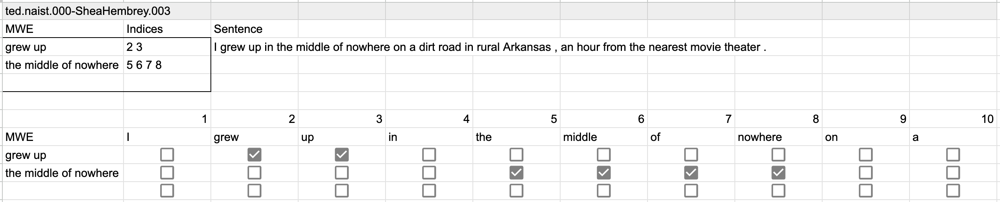

[](LICENSE)

This repository presents CAIGen, an accessible, flexible, and free annotation tool.



# Why CAIGen

CAIGen can be used for the annotation of any sequence tagging tasks in natural language processing. Its advantages include:

- **Accessible interface**: The interface is based on spreadsheets, which are familiar and accessible to both technical and non-technical annotators.
- **Flexible annotation**: The interface supports annotations of spans of any form, including discontinuous and overlapping spans.
- **Easy collaboration**: It reduces researchers' overhead of managing servers and annotator accounts by leveraging Google services.
- **Customizable interface**: You can easily customize CAIGen's interface by modifying the Google Apps Script code, a well-documented JavaScript-based language.

# What CAIGen does

It generates one Google Sheets file per annotator. Each file contains a facesheet to collect demographic information about the annotator and an arbitrary number of sheets for annotation.

To try an example of the interface, access https://docs.google.com/spreadsheets/d/1ngnVTGxCb-Kf91fhgc1h9YLtdVA58LZtQsPHmB3zQrY/copy, where you can copy the file to your Google account and play around.

# How to use

CAIGen consists of several Google Apps Script (GAS) codes. To generate an annotation interface with CAIGen, follow the steps below.

## Prepare data

Prepare JSON files, each containing a list of objects with the properties `id` and `tokens` as shown below. `tokens` should be a list of objects with the `surface` property (each token is represented as an object for future extension). Data in each JSON file will be placed on one sheet.
<!-- In JavaScript terminology, "list" is "array". But probably the users of CAIGen are more familiar with Python terminology. -->

```
[
    {
        "id": "doc1.001",
        "tokens": [
            {
                "surface": "ACL",
            },
            {
                "surface": "stands",
            },
            {
                "surface": "for",
            },
            ...
        ]
    },
    ...
]
```

<!-- Not yet implemented -->
<!-- When using pre-annotated data, the tag should denote the i`ndices of the spans the token belongs to. For example, `1` denotes that the token belongs to the first span in the sentence. If the token belongs to multiple spans, concatenate numbers with semicolons, like `1;2`.
```
"tokens": [
    {
        "surface": "ACL",
        "tag": ""
    },
    {
        "surface": "stands",
        "tag": "1"
    },
    ...
``` -->

Place the JSON files in the `data/json_files` directory. Examples can be seen in `data/sample_json_files`.

## Upload data

Upload the `data` folder to Google Drive. Optionally, you can rename it.

## Set up Clasp

To run CAIGen, you need a GAS file on Google Drive. Although there are several ways to create one, we recommend using Clasp. To do so, follow the steps below.

1. Install node if you don't have it already - we recommend [nvm](https://github.com/nvm-sh/nvm) for this.
2. Enable the [Google App Scripts API](https://script.google.com/home/usersettings). This is required for CAIGen to work. 
2. Follow the instructions in the [official repository](https://github.com/google/clasp) to install Clasp.
3. Run `clasp login` to log into your Google account.

## Upload codes

Clone this repository and navigate to the root directory.

Run `clasp create --title "caigen" --type standalone` to create a GAS file. If the GAS file creation is successful, the URL of the script will be printed. Save this URL, as you'll need it for the next steps. 

Run `clasp push` to upload the JavaScript files in the repository.

Visit the script URL to ensure that a GAS script file containing several `.gs` files is created.

## Run the code after slight modifications

### Create Google Sheets files and sheets

Open `CreateFiles.gs`.

Update the following variables:

- `annttrToSourceFiles`: A mapping from annotator IDs to source file names. The annotator IDs will be the names of the output Google Sheets (GS) files. The source file names will be the names of the sheets in each file, minus the trailing `.json`. You can also leave this as `["sheet_1.json", "sheet_2.json"]` for testing purposes. 
- `projectFolderId`: The string after `drive.google.com/drive/folders/` in the URL of the `data` folder on Google Drive. Should look something like `1Mx2_dtoEuT3gPAgOlN8qS5H8-EGQFyh9`

If you wish to test the code using sample data, you can optionally set `dataFolderName` to `'sample_json_files'`.

Run the code by pressing the "Run" button. You will need to grant access to the script the first time you run it. Proceed with: Review Permissions > Advanced > Go to annotation (unsafe) > Select all > Continue.

Visit the printed URL to ensure that a GS file is created. Note that it will be empty (no data yet), but this is normal. 

### Fill the sheets with data

Open `WriteSheets.gs`.

Set `annttr` to the annotator ID (the same ID used as a key in the `annttrToSourceFiles` dictionary from `CreateFiles.gs`). Note that CAIGen currently writes one GS file at a time to keep the process simple. This approach minimizes the risk of the process stopping midway due to longer processing times.

Run the code by pressing the "Run" button.

Note that this script can take a long time to complete. The progress log will be written at line 101 and below on the facesheet.

When the process is complete, the sheets are ready to be annotated.

## Convert annotated data into JSONL

Download the annotated spreadsheets as Excel files and place them in the `annotated` directory.

To reformat the Excel files into JSON files, follow the steps below.

1. Create a virtual Python environment and run `pip install -r requirements.txt`.
1. Run `PYTHONPATH=. python convert_excel.py`. If you used the sample folder/files `sample_json_files`, you will need to specify `-p data/sample_json_files` when you run the conversion script.  You may use the `append_span_info_to` argument to control the format of span information in the output.

# How to cite

Please consider citing our paper when you use CAIGen for your research.

```
@misc{ide2024coam,
    title={CoAM: Corpus of All-Type Multiword Expressions},
    author={Yusuke Ide and Joshua Tanner and Adam Nohejl and Jacob Hoffman and Justin Vasselli and Hidetaka Kamigaito and Taro Watanabe},
    year={2024},
    eprint={2412.18151},
    archivePrefix={arXiv},
    primaryClass={cs.CL},
    url={https://arxiv.org/abs/2412.18151},
}
```
